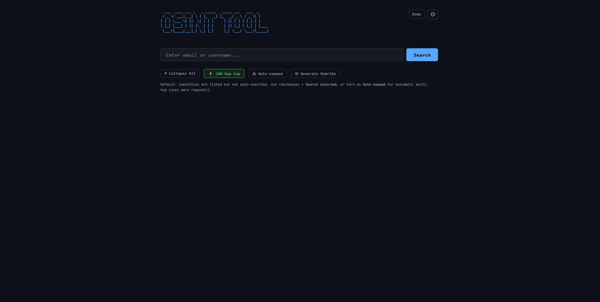
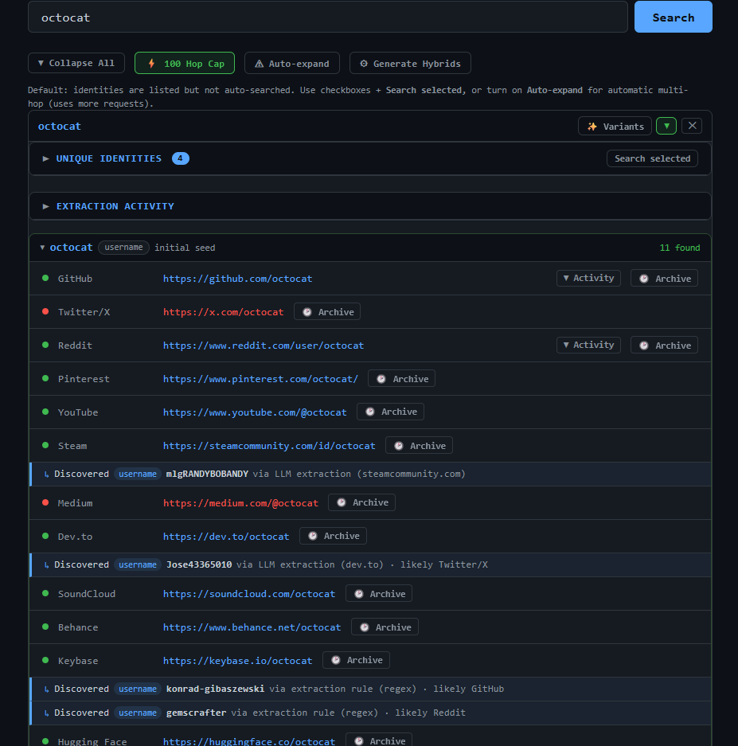
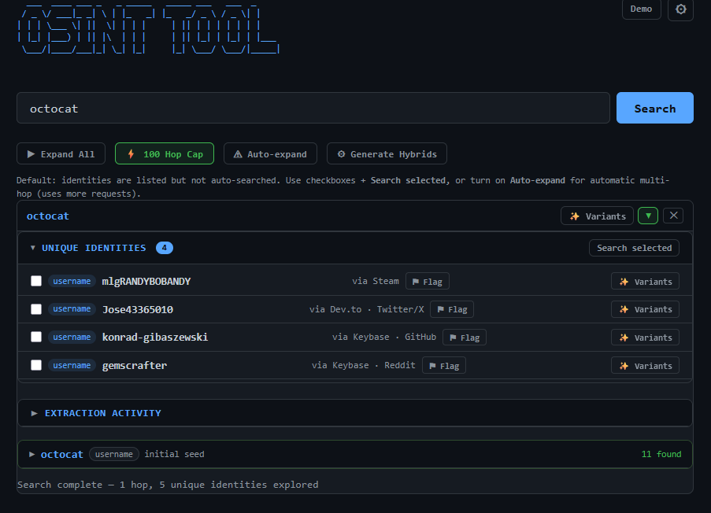
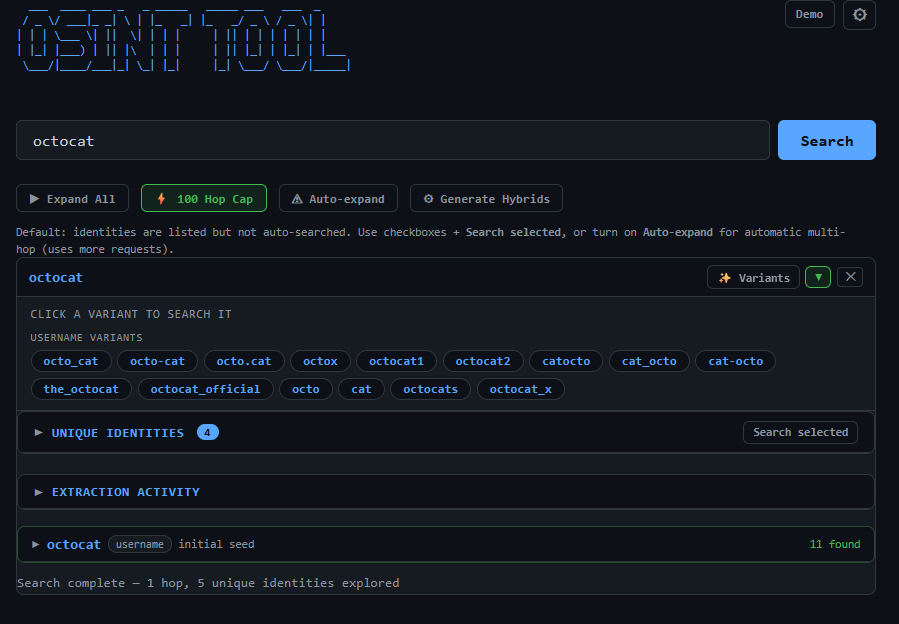
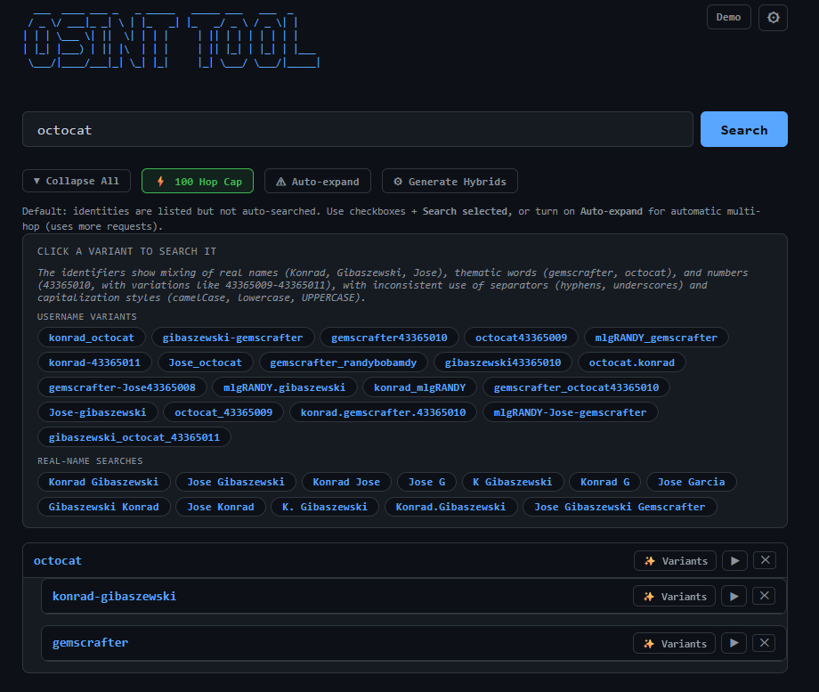
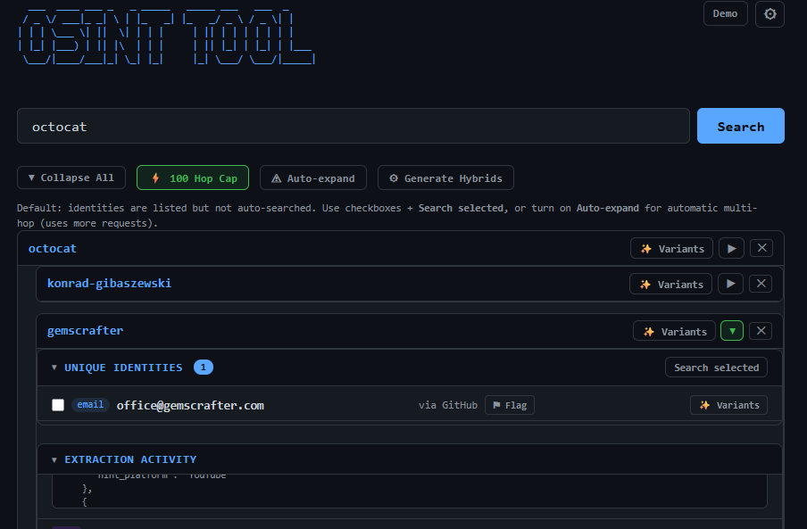
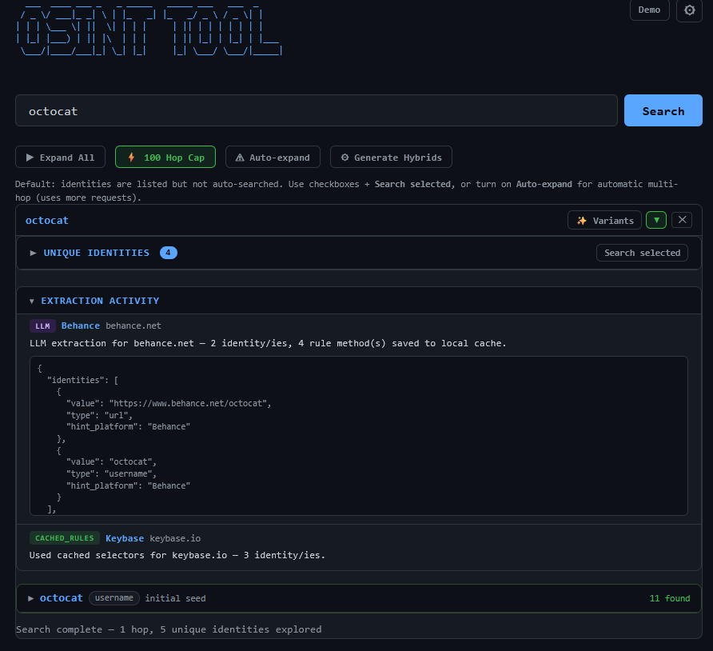

# OSINT Tool

A Python tool for **open-source intelligence** workflows: given an email or username, it checks multiple public platforms, runs **multi-hop discovery** in the web UI, and optionally uses an **Anthropic** API key for AI-assisted username variants and **LLM-guided extraction** of linked identities from profile HTML.

Use it only on targets you are **authorized** to investigate and in line with applicable laws and site terms.

## Screenshots

**Start page** — enter a username or email to begin.



**Search results** — platform checks with live status, discovered identities extracted from profile HTML via regex and LLM rules.



**Unique Identities** — deduplicated identities discovered across platforms, with options to flag, generate variants, or search selected.



**AI username variants** — LLM-generated alternative usernames to broaden the search.



**Hybrid generation** — cross-pollinated username and real-name combinations from all discovered identities.



**Multi-hop discovery** — expand found identities into child searches to explore deeper connections.



**Extraction activity & LLM rule cache** — live log of HTML extraction steps, LLM-generated scraping rules, and cached selectors.



## Requirements

- **Python 3.10+** (3.11 recommended)
- Dependencies listed in `requirements.txt`

## Setup

From this directory (the one that contains `requirements.txt` and the `osint_tool` package):

```bash
python -m venv .venv
```

**Windows (cmd / PowerShell):** `.venv\Scripts\activate`  
**Windows (Git Bash):** `source .venv/Scripts/activate`  
**macOS / Linux:** `source .venv/bin/activate`

```bash
pip install -r requirements.txt
```

## Configuration

| Method | Notes |
|--------|--------|
| **Environment** | Set `ANTHROPIC_API_KEY`. If set, it **overrides** any key in `config.json` at runtime. |
| **`.env`** | Optional. Copy `.env.example` to `.env` in this directory and set `ANTHROPIC_API_KEY=...`. Loaded on startup. |
| **`config.json`** | Optional. Created via the web **Settings** UI (stores API key and options). Gitignored by default — do not commit secrets. |

## Run

**Web UI** (default `http://127.0.0.1:8000`):

```bash
python -m osint_tool web --host 127.0.0.1 --port 8000
```

Development with auto-reload:

```bash
python -m osint_tool web --host 127.0.0.1 --port 8000 --reload
```

**CLI** (single search, terminal output):

```bash
python -m osint_tool search "username_or_email@example.com"
```

## What’s in the box

- Username checks across **27** public platforms (see `osint_tool/modules/username_enum.py`). Many sites rate-limit or block automated requests; rows may show **error** even when a profile exists—treat results as heuristic.
- **Gravatar** and hand-tuned resolvers where applicable.
- **Web:** streaming discovery, optional Reddit/GitHub activity panels, Wayback hints, extraction activity log, local rule cache for HTML/LLM extraction.
- **Docs:** `docs/PLANNING.md` (backlog and security notes).

## Repository layout

```
├── osint_tool/
│   ├── cli.py              # CLI entry
│   ├── core/               # engine, discovery, config_loader
│   ├── modules/            # platform checks, resolvers, LLM helpers
│   ├── data/               # default extraction rules (bundled)
│   └── web/                # FastAPI app + static UI
├── docs/
├── requirements.txt
├── .env.example
└── config.json             # local only (gitignored); use Settings or .env
```

## License / disclaimer

This software is provided as-is for legitimate security research and authorized testing only. You are responsible for compliance with laws and third-party terms of service.
